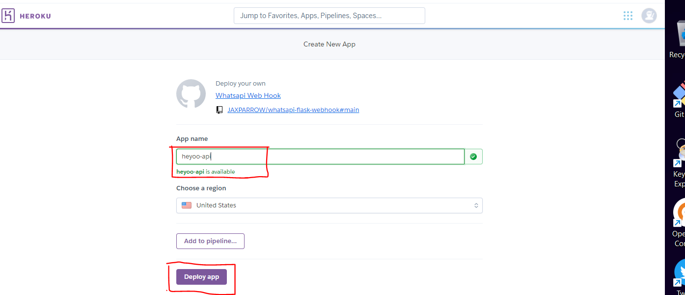
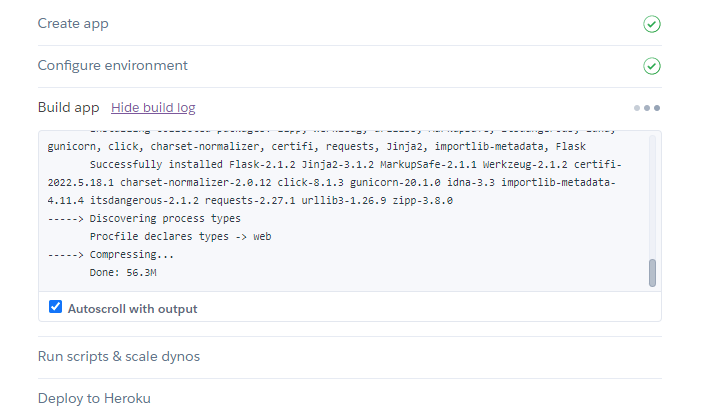
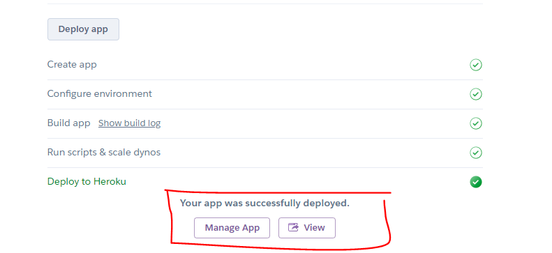
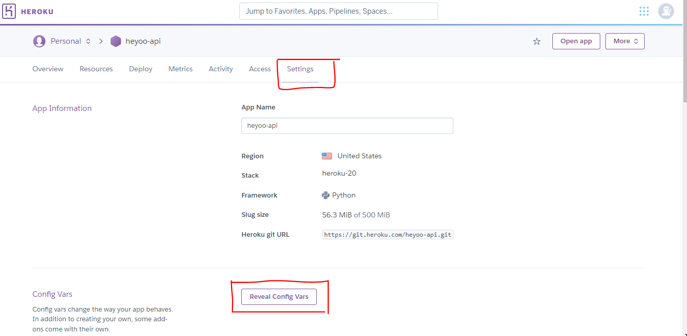
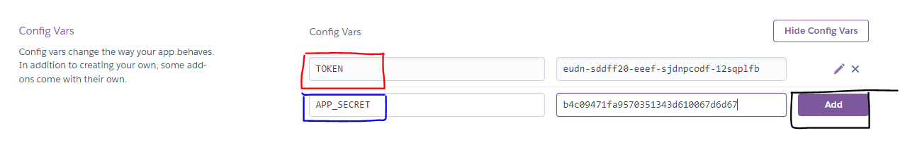
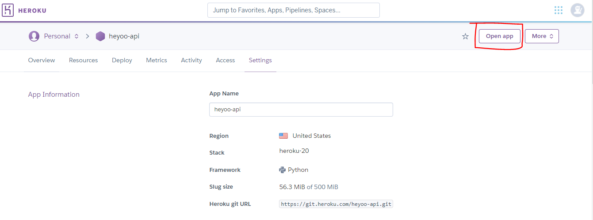
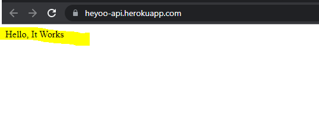
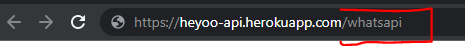

# WhatsApp Cloud API Webhooks Sample Coded using Flask

These is the sample Webhook Flask app for WhatsApp Cloud API. You can read more from [Webhooks](https://developers.facebook.com/docs/whatsapp/cloud-api/guides/set-up-webhooks) product, powered by [Flask on Heroku](https://devcenter.heroku.com/articles/getting-started-with-python).

1. [Heyoo](https://github.com/JAXPARROW/heyoo) - Unofficial python wrapper to WhatsApp Cloud API.

# Setup

### WhatsApp Cloud API Webhooks
1. Deploy the sample app on Heroku with this button:

    
    

2. After Clicking the deploy button you will be required to login to Heroku to continue specifying the app name and region, then Click Deploy App button.

    

3. Clicking the Deploy button will start building your app now sit back and relax while Heroku platform builds and deploy your application automatically. You can even see the progress of the build.

    

4. When Heroku has completed deploying your application sucessfully, you will be presented with two buttons at the button, Click the one that says **Manage App**

    

5. Go to the **Settings > Reveal Config Vars**, for the key **TOKEN** just input any random string of characters in this field no worries, and as for **APP_SECRET** here input you application Secter you can get this from the Facebook Developer's Dashboard.

    📌📌[Here's is an article on how to get your APP_SECRET from Facebook](https://support.appmachine.com/support/solutions/articles/80000978442)

    

    
    

6. When you have finished, click **Open app** at the top right corner of you dashboard to go to you application, you will presented with simple status that **"Hello, It Works"**

    

    

7. Now your Callback url will be located at `/whatsapi` at the end of you apllication url, example `https://heyoo-api.herokuapp.com/whatsapi`

    

8. Set up your client's [subscription] using your `https://<your-subdomain>.herokuapp.com/whatsapi` as the callback URL. It is recommended that you set a `TOKEN` and `APP_SECRET` [config var](https://devcenter.heroku.com/articles/config-vars) as part of the set up of your Heroku app to secure requests. If you choose not to set a config var, then you will need to set a verify token of 'token' when configuring the callback URL.
   

## Contributions
All the contributions are valued and welcomed to make this package better for everyone. You can contribute on better documentations, code refactoring and optimaztion or anything you think will add value.

## References 
1. [WhatsApp Cloud API official documentation](https://developers.facebook.com/docs/whatsapp/cloud-api/)
2. [Heyoo WhatsApp API Python Wrapper](https://github.com/Neurotech-HQ/heyoo)
3. [Create a Facebook App ID App Secret](https://support.appmachine.com/support/solutions/articles/80000978442)

## Related WhatsApp Cloud API Wrappers
1. [Heyoo Python](https://github.com/Neurotech-HQ/heyoo)
2. [WhatsApp Cloud API PHP Wrapper ](https://github.com/pro-cms/whatsappcloud-php)
3. [Heyoo Javascript](https://github.com/JS-Hub-ZW/heyooh)

## All the credit
1. [Jaxparrow](https://github.com/JAXPARROW/)
2. [kalebu](https://github.com/Kalebu)
3. Other Contributors
